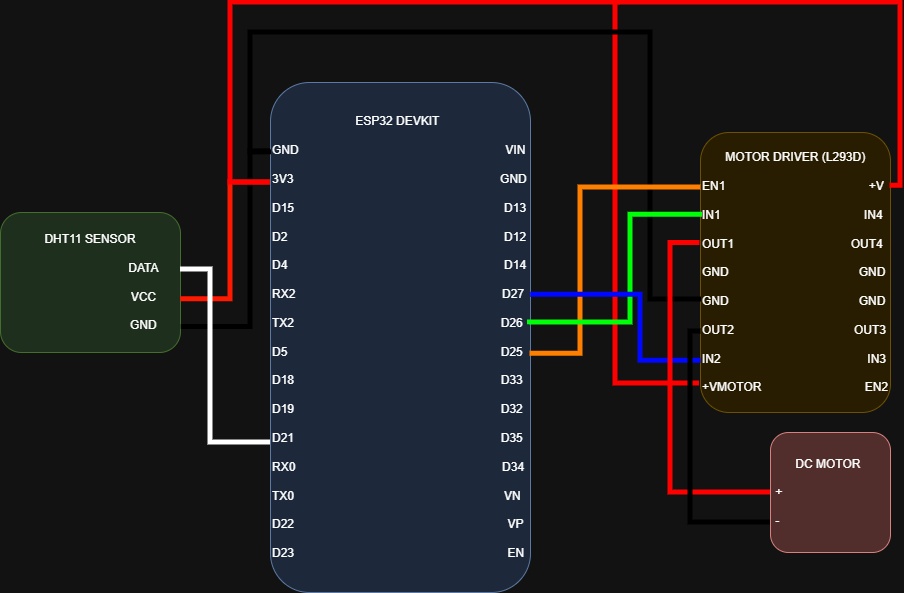

# Climate Node

## Overview

This project is an ESP32-based embedded system that monitors temperature and humidity using a DHT11 sensor. It provides a real-time web dashboard, logs environmental data to onboard flash storage using LittleFS, and controls a DC fan using PWM based on temperature thresholds.

The system operates fully standalone after flashing and does not require cloud services or external infrastructure.


---

## Features

- Real-time temperature and humidity monitoring
- Embedded web dashboard hosted on ESP32
- Live updating charts using Chart.js
- REST API for sensor data (`/data`)
- Downloadable log file (`/log`)
- Local persistent logging using LittleFS (CSV format)
- NTP time synchronization for timestamped logs
- Non-blocking sensor reads for stable performance
- Automatic fan control using PWM

---

## Hardware Requirements

- ESP32 development board
- DHT11 temperature and humidity sensor
- DC fan or DC motor
- Motor driver (L293D)
- External power supply for motor (recommended)

---

## Pin Configuration

| Function       | GPIO Pin |
|----------------|----------|
| DHT11 Data     | 21       |
| Motor IN1      | 27       |
| Motor IN2      | 26       |
| Motor PWM EN   | 25       |

---

## Wiring Diagram



---

## Software Dependencies

Install the following using Arduino Library Manager:

- ESP32 Arduino Core
- WiFi (built into ESP32 core)
- WebServer (built into ESP32 core)
- LittleFS (built into ESP32 core)

Install arduino-littlefs-upload, following https://github.com/earlephilhower/arduino-littlefs-upload

---

## Web Interface

The ESP32 hosts a local web server with the following endpoints:

### `/`

Main dashboard showing live temperature, humidity, and real-time chart.

---

### `/data`

Returns current sensor readings in JSON format.

---

### `/log`

Streams the full CSV log file stored in flash memory.

---

## System Behavior

### Sensor Sampling

- Sensor readings occur every 3 seconds
- Non-blocking implementation ensures web server responsiveness

---

### Logging

- Each valid reading is appended to `/log.csv`
- Entries include timestamp, temperature, and humidity
- Data persists across device reboots

---

### Fan Control Logic

- Fan OFF below 24°C
- Linear ramp between 26°C and 30°C
- Full speed above 30°C
- PWM output controls motor driver enable pin

---

## File Storage

Sensor logs are stored in internal flash using LittleFS:

```
/log.csv
```

This file can be accessed through the `/log` endpoint and downloaded via browser.

---

## Setup Instructions

1. Install ESP32 board support in Arduino IDE
2. Select correct ESP32 board and COM port
3. Use LittleFS to flash /data folder to ESP32
4. Upload climateNode.ino to the ESP32
5. Open Serial Monitor to obtain device IP address
6. Enter IP address in a browser to access dashboard

---

## IOS Installation Instructions

1. Enter IP address in Safari
2. Select the button with 3 dots on the bottom
3. Select Share
4. Select View More
5. Select Add to Home Screen
6. Make sure Open as Web App is selected
7. Select Add

---

## API Reference

### GET /data

Returns current sensor readings.

Example:

```json
{
  "temperature": 25,
  "humidity": 48
}
```

---

### GET /log

Returns stored sensor history in CSV format.

Example:

```
2026-06-26 12:00:01, 25, 48
2026-06-26 12:00:04, 25, 47
```

---

## Notes

- DHT11 has limited accuracy and slow response time
- PWM frequency and motor driver quality affect motor stability
- LittleFS flash has limited write cycles; excessive logging may reduce lifespan over time
```